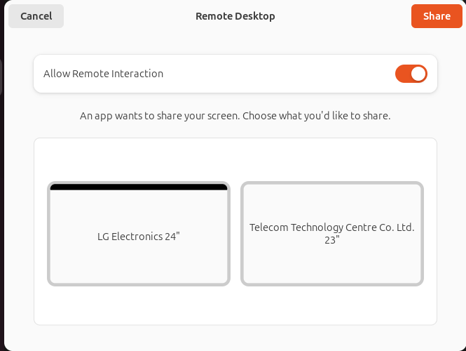

# Unattended Remote Desktop on Ubuntu 24.04 (Wayland, GNOME) — Portal Auto-Approve Patch

How to get rid of this brain-dead prompt that keeps appearing on Wayland when trying to use TeamViewer and/or RustDesk?



This README is **strict and opinionated**. Follow it **exactly** on **Ubuntu 24.04 LTS (Noble)** with **GNOME on Wayland** and the **GNOME xdg-desktop-portal backend**. Now supports unattended approval for both RemoteDesktop (e.g., TeamViewer) and ScreenCast (e.g., RustDesk).

> **What this does:** Applies a minimal patch to GNOME’s `xdg-desktop-portal-gnome` so that:
>
> * **Remote-Desktop** is **auto-approved** with **“Allow Remote Interaction”** enabled — **no user interaction** (mapped-aware + idle fallback ensures it fires even if `notify::mapped` misbehaves).
> * **Screencast** auto-selects the **first monitor** when there’s no valid restore data (no chooser) and **auto-approves** the Share/Accept action — **no user interaction**.
>
> Use only on machines you own/administer. This intentionally bypasses a security prompt.

> **How we pick the correct portal version:** We no longer tell you to manually choose a tag or guess a version.
> The included **`tools_portal_tag_probe.py`** discovers the newest upstream **release tag** that actually **configures with Meson on *your* machine**, then (optionally) checks it out. In practice it will try tags from **49.0** downward until a match is found — commonly **✅ Compatible tag: 46.2** on Ubuntu 24.04 — which avoids configure-time dependency errors like:
>
> `subprojects/libgxdp/meson.build:9:10: ERROR: Dependency lookup for gtk4 with method 'pkgconfig' failed: Invalid version, need 'gtk4' ['>= 4.17.1'] found '4.14.5'.`

---

## Quick Start (TL;DR)

Below is the whole flow with **why** each step exists and **what you should see** if it worked.

```bash
# 1) Clone this repo and enter it — so everything stays project-local and reversible.
git clone https://github.com/BigBIueWhale/ubuntu_patch_unattended_access && cd ubuntu_patch_unattended_access
```

**Expect:** a new folder named `ubuntu_patch_unattended_access` and your shell prompt inside it.

```bash
# 2) Refresh package indices — guarantees the next installs see the latest package lists.
sudo apt update
```

**Expect:** “Hit/Get” lines and “Reading package lists… Done”. No errors.

```bash
# 3) Install toolchain and headers — these are needed for Meson/Ninja builds and GLib introspection.
sudo apt install -y git build-essential ninja-build meson gettext libtool pkg-config gobject-introspection libglib2.0-dev
```

**Expect:** Packages install or are reported as already the newest version.

```bash
# 4) Enable source repositories using the Deb822 method (Ubuntu 24.04 default).
#    Why: 'apt build-dep xdg-desktop-portal-gnome' needs access to *source* indices.
#    We patch the system-provided Deb822 file instead of touching /etc/apt/sources.list.
#    First, make a backup you can revert to in one command:
sudo cp /etc/apt/sources.list.d/ubuntu.sources /etc/apt/sources.list.d/ubuntu.sources.bak
```

**Expect:** The command exits silently. If the file doesn’t exist, you’re on a non-standard setup — stop and check your APT configuration.

```bash
# 5) Add 'deb-src' to any 'Types: deb' stanzas in the Deb822 file — this turns on source indexes.
sudo sed -i 's/^\(Types:\s*deb\)\(\s\+\|\s*$\)/\1 deb-src\2/' /etc/apt/sources.list.d/ubuntu.sources
```

**Expect:** No output. The file now contains `Types: deb deb-src` for relevant stanzas.

```bash
# 6) Re-sync APT indices now that sources are enabled.
sudo apt update
```

**Expect:** You should see lines for `InRelease` and `Sources` being fetched. No errors.

```bash
# 7) Pull distro-provided build dependencies for xdg-desktop-portal-gnome — this smooths the Meson configure step.
sudo apt build-dep -y xdg-desktop-portal-gnome
```

**Expect:** Packages get installed. If you still see “You must put some 'deb-src' URIs…”, re-check Step 5 and confirm `Types: deb deb-src` exists in `/etc/apt/sources.list.d/ubuntu.sources`.

```bash
# 8) Make a local place for upstream sources (kept under the project).
mkdir -p ./sources
```

**Expect:** A `sources/` directory appears under the project.

```bash
# 9) Auto-detect the newest upstream *compatible* tag and check it out locally.
#    This will clone the portal repo into ./sources/xdg-desktop-portal-gnome if missing,
#    fetch tags, probe them from newest to oldest, print the chosen tag, and check it out.
python3 ./tools_portal_tag_probe.py --repo ./sources/xdg-desktop-portal-gnome --checkout --print-tag
```

**Expect:** A single line with the chosen tag (e.g., `46.2`) and the repo at `./sources/xdg-desktop-portal-gnome` now checked out at that tag.
If no compatible tag is found, the script will explain recent failures (GTK requirements, etc.). You can add `--show-failures` for a brief summary.

```bash
# 10) Apply this repo’s patcher — validates layout and edits only what’s needed.
python3 ./patch_portal_autoapprove.py ./sources/xdg-desktop-portal-gnome
```

**Expect:**

* Verifies the expected layout using strict sentinels.

* **Refuses to run if a `.bak` backup already exists** for any target file (safety).

* Creates backups:
  * `sources/xdg-desktop-portal-gnome/src/remotedesktopdialog.c.bak`
  * `sources/xdg-desktop-portal-gnome/src/screencastwidget.c.bak`
  * `sources/xdg-desktop-portal-gnome/src/screencastdialog.c.bak`

* Prints `[OK] Patched …remotedesktopdialog.c`, `[OK] Patched …screencastwidget.c`, and `[OK] Patched …screencastdialog.c` (or `[SKIP] … already patched`).

If you see `[ERROR] Sentinel not found`, the checked-out sources **don’t match the expected layout** for this patcher. See the **Patcher layout note** below.

```bash
# 11) Build the project with Meson/Ninja — produces the patched binaries under ./sources/.../build.
cd ./sources/xdg-desktop-portal-gnome && meson setup --wipe build --prefix=/usr --buildtype=release && ninja -C build
```

**Expect:** Meson detects your system and finishes with “Build targets in project: …”. Ninja compiles without errors.

```bash
# 12) Install and restart user portal services — switches your session to the patched backend.
systemctl --user stop xdg-desktop-portal-gnome.service xdg-desktop-portal.service && sudo ninja -C build install && systemctl --user daemon-reload && systemctl --user restart xdg-desktop-portal-gnome.service xdg-desktop-portal.service
```

**Expect:** Both services come back as “active (running)”. See verification below if you want to double-check.

```bash
# 13) Prevent upgrades from overwriting your patched portal (recommended).
sudo apt-mark hold xdg-desktop-portal-gnome

# (Later, to allow updates again)
# sudo apt-mark unhold xdg-desktop-portal-gnome
```

**Expect:** `xdg-desktop-portal-gnome` shows up in `apt-mark showhold`.

(Optional quick check:)

```bash
apt-mark showhold | grep -x 'xdg-desktop-portal-gnome' && echo "Hold active"
```

> **Patcher layout note:** The patcher is intentionally strict and was authored against the 46.2 / 49.0 file layout.
> 46.2/49.0 releases share the same relevant regions; if the auto-selected version diverges, the script will refuse with a clear sentinel error so you don’t accidentally patch the wrong code. If your **auto-detected** tag doesn’t match, either:
>
> * upgrade your toolchain so a newer tag configures (e.g., newer GTK), **or**
> * adapt the patch manually to the checked-out tag (open the files listed in the error and apply the same logical changes).

---

## 0) Preconditions — Verify Environment

Why: Ensures you’re on the intended distro and desktop so the portal backend and source tree match what we patch.

```bash
lsb_release -ds
```

**Expect:** `Ubuntu 24.04.* LTS`.

```bash
gnome-shell --version
```

**Expect:** `GNOME Shell 46.x`.

```bash
dpkg -s xdg-desktop-portal | grep '^Version'
```

**Expect:** A `1.18.x` (Noble-era) version string.

```bash
dpkg -s xdg-desktop-portal-gnome | grep '^Version'
```

**Expect:** A `49.x` or `46.x` series version string (distro package; we will build from an upstream tag chosen by the probe).

Portal backend must be **GNOME**:

```bash
systemctl --user status xdg-desktop-portal-gnome.service --no-pager
```

**Expect:** `Active: active (running)`.

```bash
busctl --user list | grep -E 'org\.freedesktop\.impl\.portal\.desktop\.(gnome|kde|wlr)'
```

**Expect:** a line containing `org.freedesktop.impl.portal.desktop.gnome`. If you see KDE or wlr, switch to GNOME Wayland.

```bash
journalctl --user -u xdg-desktop-portal.service -b --no-pager | grep -i -E 'backend|gnome|portal'
```

**Expect:** Entries showing GNOME backend ownership.

```bash
test -f ~/.config/xdg-desktop-portal/portals.conf && cat ~/.config/xdg-desktop-portal/portals.conf || echo "No user override file"
```

**Expect:** Either no file (default) or a config that doesn’t force a different backend.

*If a different backend (KDE/wlr) is active, switch to GNOME Wayland and ensure the GNOME backend owns the name before continuing.*

---

## 1) Keep Everything Project-Local

Why: Keeping all work under the repo makes it simple to see what changed, revert it, and avoid surprising your system.

After following the steps below, your tree will look like:

```
ubuntu_patch_unattended_access/
├── patch_portal_autoapprove.py
├── README.md
├── tools_portal_tag_probe.py
└── sources/
    └── xdg-desktop-portal-gnome/   # upstream sources at an auto-detected compatible tag
```

**Expect:** The `sources/xdg-desktop-portal-gnome` directory contains the GNOME Git clone fixed at the tag chosen by the probe (often `46.2` on Ubuntu 24.04, otherwise the newest one your toolchain supports).

---

## 2) Install Toolchain & Headers (Ubuntu packages)

Why: Meson/Ninja build system, gettext/libtool/pkg-config for configure steps, GLib dev headers and introspection for the portal code.

```bash
sudo apt update
```

```bash
sudo apt install -y git build-essential ninja-build meson gettext libtool pkg-config gobject-introspection libglib2.0-dev
```

**Expect:** Successful installation. If Meson later complains about missing -dev packages, return here and re-run the install line.

### Enable Source Repositories (Deb822 method, Ubuntu 24.04)

Why: `apt build-dep` needs access to *source* package metadata. On Noble, APT uses Deb822 stanzas in `/etc/apt/sources.list.d/ubuntu.sources`, so uncommenting `/etc/apt/sources.list` won’t help. We patch the Deb822 file safely and reversibly.

```bash
sudo cp /etc/apt/sources.list.d/ubuntu.sources /etc/apt/sources.list.d/ubuntu.sources.bak
```

**Expect:** Silent success. This backup lets you revert in one command later.

```bash
sudo sed -i 's/^\(Types:\s*deb\)\(\s\+\|\s*$\)/\1 deb-src\2/' /etc/apt/sources.list.d/ubuntu.sources
```

**Expect:** No output. This changes `Types: deb` to `Types: deb deb-src` across relevant stanzas.

```bash
sudo apt update
```

**Expect:** You should now see `Sources` indices being fetched. If not, re-check the Deb822 file.

```bash
sudo apt build-dep -y xdg-desktop-portal-gnome
```

**Expect:** Build dependencies are installed. Any “You must put some 'deb-src' URIs …” means the Deb822 patch didn’t apply; revisit the sed step.

---

## 3) Fetch Upstream Sources (auto-chosen tag) — Project-Local

Why: The probe script discovers a tag that **configures** with your installed toolchain (GTK, libadwaita, etc.), eliminating guesswork and avoiding Meson errors.

```bash
mkdir -p ./sources
python3 ./tools_portal_tag_probe.py --repo ./sources/xdg-desktop-portal-gnome --checkout --print-tag
```

**Expect:** It prints a tag like `46.2` and checks out that tag in `./sources/xdg-desktop-portal-gnome`.
If you prefer a machine-readable output: `--json`. For brief reasons why newer tags failed: add `--show-failures`.

> **Why this matters:** Ubuntu 24.04 typically ships GTK4 **4.14.x**, while some newer portal tags require **>= 4.17.1**. The probe will naturally skip those and pick a compatible release (e.g., **46.2**) so that:
>
> `meson setup build --prefix=/usr --buildtype=release`
> does **not** fail with a GTK version error.

---

## 4) Apply the Patch

Why: The script validates the source layout first, then does minimal, targeted edits, taking `.bak` backups so you can revert.

```bash
python3 ./patch_portal_autoapprove.py ./sources/xdg-desktop-portal-gnome
```

**Expect:**

* Verifies the expected layout using strict sentinels.

* Creates backups:
  * `sources/xdg-desktop-portal-gnome/src/remotedesktopdialog.c.bak`
  * `sources/xdg-desktop-portal-gnome/src/screencastwidget.c.bak`
  * `sources/xdg-desktop-portal-gnome/src/screencastdialog.c.bak`

* **Refuses to run if any of those `.bak` files already exist** (to protect an earlier backup).

* Prints `[OK] Patched ...` (or `[SKIP] ... already patched`)

If you get `[ERROR]` about sentinels/layout, the checked-out tag’s code doesn’t exactly match what the patcher expects.
See the **Patcher layout note** in the Quick Start for options.

---

## 5) Build (Project-Local source tree)

Why: Produces patched binaries under a `build` directory, keeping the working tree clean.

```bash
cd ./sources/xdg-desktop-portal-gnome && meson setup build --prefix=/usr --buildtype=release && ninja -C build
```

**Expect:** Meson completes configuration; Ninja compiles without errors. If configuration fails (missing -dev packages), go back to Section 2 and then:

```bash
meson setup build --wipe --prefix=/usr --buildtype=release && ninja -C build
```

**Expect:** A clean reconfigure and successful build.

---

## 6) Install and Restart Portal Services

Why: We stop user services so the new backend can be installed and then brought up cleanly in your session.

```bash
systemctl --user stop xdg-desktop-portal-gnome.service xdg-desktop-portal.service
```

**Expect:** Both services stop without error.

```bash
sudo ninja -C build install
```

**Expect:** Files are installed under `/usr`. No errors.

```bash
systemctl --user daemon-reload
```

**Expect:** No output. This reloads user unit files.

```bash
systemctl --user restart xdg-desktop-portal-gnome.service xdg-desktop-portal.service
```

**Expect:** Services restart and become **active (running)**.

```bash
journalctl --user -u xdg-desktop-portal-gnome -u xdg-desktop-portal -b --no-pager
```

**Expect:** Recent logs show clean startup. Occasional “Failed to associate portal window with parent window” lines can be benign; what matters is both services are active and portal requests work.

*If a different desktop backend (KDE/wlr) is active for your session, the patch will not apply; ensure **GNOME** owns the backend name.*

---

## 7) Keep Your Patch Across APT Upgrades (apt-mark hold)

**Why:** A standard `sudo apt upgrade` will replace your locally installed, patched
`xdg-desktop-portal-gnome` with the distro’s package the next time it’s updated.
APT/dpkg does not treat your `/usr` install as a “local modification.”

**Solution (simple): hold the package.**

```bash
# Prevent upgrades from overwriting the patched portal backend
sudo apt-mark hold xdg-desktop-portal-gnome
```

**Verify the hold:**

```bash
apt-mark showhold | grep -x 'xdg-desktop-portal-gnome' && echo "Hold active"
```

**Unhold later (to take updates or to rebuild/reinstall your patch):**

```bash
sudo apt-mark unhold xdg-desktop-portal-gnome
# then update/upgrade as usual
sudo apt update
sudo apt upgrade
```

> ⚠️ **Trade-off:** While on hold, you will not receive security/bug-fix updates for
> `xdg-desktop-portal-gnome`. When you’re ready, `unhold`, let it upgrade, then
> re-apply/rebuild your patch (Sections 3–6), and `hold` again if desired.

---

## 8) What Exactly Changes (Code-Level Summary)

* **`src/remotedesktopdialog.c`**

  * Adds a helper `auto_share_response(RemoteDesktopDialog *dialog)` that:

    * Forces a selection state so **Share** is permitted:
      `dialog->is_screen_cast_sources_selected = TRUE;`
    * Turns **“Allow Remote Interaction”** ON:
      `adw_switch_row_set_active(dialog->allow_remote_interaction_switch, TRUE);`
    * Re-evaluates button sensitivity:
      `update_button_sensitivity(dialog);`
    * Programmatically **clicks Share**:
      `g_signal_emit_by_name(dialog->accept_button, "clicked");`

  * Adds a **mapped-aware** one-shot handler `on_dialog_notify_mapped(...)` that:

    * Hooks **`notify::mapped`** (fires when the window is actually on-screen).
    * **Schedules** the helper via `g_timeout_add(120, …)` (≈ one tick later).
      This is **non-blocking** and gives callers (TeamViewer/RustDesk) time to connect their “done” signal before we auto-accept.

  * Inside `remote_desktop_dialog_init(...)` (right after `gtk_widget_init_template(GTK_WIDGET(dialog));`), installs **both**:

    * `g_signal_connect_after(dialog, "notify::mapped", G_CALLBACK(on_dialog_notify_mapped), dialog);`
    * **Idle fallback**: `g_idle_add((GSourceFunc) auto_share_response, dialog);` (runs even if the mapping notify never arrives).

  **Result:** The consent dialog never blocks. It may flash briefly or not appear, then auto-dismisses **after it’s actually mapped** (or via idle fallback), and only after a short, non-blocking defer—so the caller reliably receives the “done” reply. This eliminates the “no pop up + connection fails” race and guarantees **truly unattended** operation.

* **`src/screencastwidget.c`**

  * In `update_monitor_container(ScreenCastWidget *widget)`:

    * Stores `int child_count = screen_cast_geometry_container_get_child_count(...);`
    * Preserves the original **“singular”** CSS toggle.
    * **Auto-selects the first monitor** when `child_count > 0 && !widget->allow_multiple`:

      * `GtkWidget *first_button = gtk_widget_get_first_child(monitor_container);`
      * `gtk_toggle_button_set_active(GTK_TOGGLE_BUTTON(first_button), TRUE);`

  **Result:** When there is no valid restore token, Screencast preselects the first monitor automatically; combined with the dialog changes above, the monitor grid typically never appears **and no user interaction is required**.

* **`src/screencastdialog.c`**

  * Adds a helper `auto_share_response(ScreenCastDialog *dialog)` that:

    * Programmatically **clicks Share**:
      `g_signal_emit_by_name(dialog->accept_button, "clicked");`

  * Adds a **mapped-aware** one-shot handler `on_dialog_notify_mapped(...)` that:

    * Hooks **`notify::mapped`** (fires when the window is actually on-screen).
    * **Schedules** the helper via `g_timeout_add(120, …)` (≈ one tick later).
      This is **non-blocking** and gives callers (e.g., RustDesk) time to connect their “done” signal before we auto-accept.

  * Inside `screen_cast_dialog_init(...)` (right after `gtk_widget_init_template(GTK_WIDGET(dialog));`), installs **both**:

    * `g_signal_connect_after(dialog, "notify::mapped", G_CALLBACK(on_dialog_notify_mapped), dialog);`
    * **Idle fallback**: `g_idle_add((GSourceFunc) auto_share_response, dialog);` (runs even if the mapping notify never arrives).

  **Result:** The ScreenCast consent dialog never blocks. It may flash briefly or not appear, then auto-dismisses **after it’s actually mapped** (or via idle fallback), and only after a short, non-blocking defer—so the caller reliably receives the “done” reply. This enables **truly unattended** ScreenCast flows like RustDesk.

---

## 9) Testing

Why: Validates behavior at runtime.

1. Start a Remote-Desktop/Screencast client that uses **xdg-desktop-portal** (e.g., TeamViewer or RustDesk server integration).
2. Observe that no consent dialog appears.
3. The session should start with **remote input allowed** (for RemoteDesktop) and the **first monitor** shared (for ScreenCast).

Optional live logs:

```bash
journalctl --user -fu xdg-desktop-portal-gnome -u xdg-desktop-portal
```

**Expect:** When a client starts a session, you’ll see portal activity without UI prompts.

---

## 10) Rollback (Return to Stock)

**Option A — Reinstall distro package**

Why: Restores the official package files.

```bash
sudo apt install --reinstall xdg-desktop-portal-gnome && systemctl --user daemon-reload && systemctl --user restart xdg-desktop-portal-gnome.service xdg-desktop-portal.service
```

**Expect:** Services restart; behavior returns to stock (with consent dialogs).

**Option B — Restore backups and reinstall your local build**

Why: Undo just your source edits while keeping your local build flow.

```bash
cd ./sources/xdg-desktop-portal-gnome && cp src/remotedesktopdialog.c.bak src/remotedesktopdialog.c && cp src/screencastwidget.c.bak src/screencastwidget.c && cp src/screencastdialog.c.bak src/screencastdialog.c && meson setup build --wipe --prefix=/usr --buildtype=release && ninja -C build && sudo ninja -C build install && systemctl --user daemon-reload && systemctl --user restart xdg-desktop-portal-gnome.service xdg-desktop-portal.service
```

**Expect:** Services restart; patched behavior is removed.

**Reverting the Deb822 change (optional)**

```bash
sudo mv /etc/apt/sources.list.d/ubuntu.sources.bak /etc/apt/sources.list.d/ubuntu.sources && sudo apt update
```

**Expect:** Source indices are no longer fetched; system returns to pre-change APT configuration.

---

## 11) Notes on Restore Tokens & Persistence

Wayland portals use **single-use** restore tokens. Well-behaved apps rotate them after each success. This patch **bypasses** the consent path and **auto-shares the first monitor**, preventing “stale token → prompt” loops from blocking unattended operation. If an app never reaches the portal start flow, that’s outside the portal’s scope.

---

## 12) Security & Responsibility

This removes a user consent step that GNOME ships intentionally. Apply only on systems you control with explicit authorization to allow unattended access. Keep machines physically secure and restrict who can start remote-desktop clients.

---

## 13) References

* Upstream project: [https://gitlab.gnome.org/GNOME/xdg-desktop-portal-gnome](https://gitlab.gnome.org/GNOME/xdg-desktop-portal-gnome)
* Tag used: **auto-detected by `tools_portal_tag_probe.py`** (often chooses **46.2** on Ubuntu 24.04 due to GTK constraints; otherwise the newest compatible tag)
* Files affected:

  * `src/remotedesktopdialog.c`
  * `src/screencastwidget.c`
  * `src/screencastdialog.c`

---

### Troubleshooting

* **Backend mismatch:** Ensure **GNOME** owns `org.freedesktop.impl.portal.desktop.gnome`.
* **Probe picked a tag but Meson still fails:** Make sure you *built* in a fresh `build/` (`meson setup build --wipe ...`) and that you actually ran the probe with `--checkout`.
* **GTK version error (e.g., needs >= 4.17.1 but found 4.14.5):** That’s exactly what the probe avoids; rerun Step 3 to ensure you used the chosen tag (commonly **46.2** on Ubuntu 24.04).
* **Patcher sentinel error:** The target tag’s file layout differs from what the patcher expects. Either upgrade your toolchain so a newer tag configures that matches the layout, or patch manually following the comments in `patch_portal_autoapprove.py`.
* **Missing deps:** Re-run Section 2; then `meson setup build --wipe --prefix=/usr --buildtype=release && ninja -C build`.
* **Portal logs:** `journalctl --user -u xdg-desktop-portal-gnome -u xdg-desktop-portal -b --no-pager` to inspect startup and requests.
* **App still prompts:** Confirm the request goes through **xdg-desktop-portal** (visible in logs) and that the GNOME backend is in use (not KDE/wlr).
* **RustDesk still prompts:** Confirm the request uses the ScreenCast portal path (check logs for "ScreenCast" mentions) and that the first monitor is auto-selected (via screencastwidget patch). Ensure the GNOME backend is active.
* **“Backup already exists” error:** The patcher refuses to overwrite existing backups. Move/rename `src/*.c.bak` files and re-run.
* **Never require interaction guarantee:** Ensure your `remotedesktopdialog.c` contains both the mapped hook and the idle fallback, and that `auto_share_response(...)` sets `dialog->is_screen_cast_sources_selected = TRUE;`.

---

### Appendix: Using the Tag Probe Tool Directly

The probe has a small CLI you can use for scripting:

```bash
# Print just the chosen tag (machine-friendly):
python3 ./tools_portal_tag_probe.py --repo ./sources/xdg-desktop-portal-gnome --print-tag

# Check out the chosen tag after discovery (also prints it, if you add --print-tag):
python3 ./tools_portal_tag_probe.py --repo ./sources/xdg-desktop-portal-gnome --checkout --print-tag

# Emit JSON with the chosen tag and repo path:
python3 ./tools_portal_tag_probe.py --repo ./sources/xdg-desktop-portal-gnome --json

# Show brief reasons why newer tags failed Meson setup (e.g., GTK/libadwaita requirements):
python3 ./tools_portal_tag_probe.py --repo ./sources/xdg-desktop-portal-gnome --show-failures
```

These commands are optional; the main flow already uses the probe to remove any manual tag selection.
